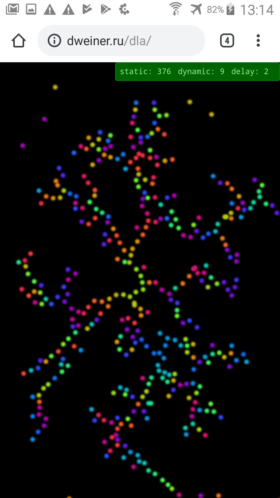

# DLA tree in browser
## Grow you own tree



Based on natural process https://en.wikipedia.org/wiki/Diffusion-limited_aggregation

Working example: http://dweiner.ru/dla

### Build

```
$ npm i
```

```
$ npm run build
```

Open in browser:
```
dist/index.html
```

Click on the screen as fast as you can to produce more resources for tree growth.

### TODO

* Add silly sounds

* Generate points while pressed

* Generate points on mouse move

* Add constols, stats [x]

* Add dissolving points 
